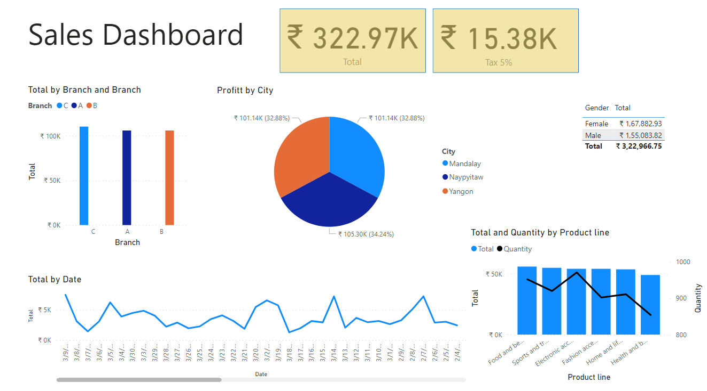
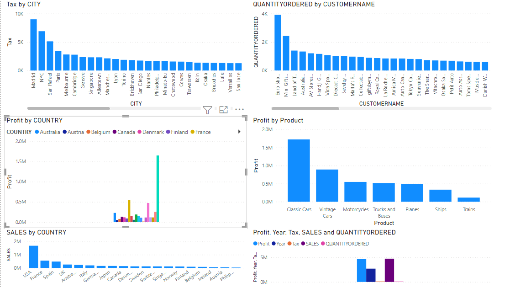

# portfilo.io
-I am currently working on my portfilo account. 
-My Another_Github Account :<a href="https://github.com/Kolte96/DPython">https://github.com/Kolte96/DPython</a> 
https://github.com/Kolte96/DPython
<h4> Find me around the web</h4>
-My Linkdin Profile:<a href :<a hred="https://www.linkedin.com/in/gauri-kolte-274bb9160">Linkdinprofile_Gauri_Kolte</a> 
-My Portfilo_github account :<a href="https://github.com/Kolte96/portfilo.io">Kolte96/portfilo.io@github</a> 

#Project 1:Exploratory Data Analysis on titanic data set
#Code Link: 
-<a href="https://github.com/Kolte96/portfilo.io/blob/main/Titanic_Dataset_EDA.ipynb">Titanic_code</a> 
-Operation on Data: 
-Cheking duplicates 
-Checking null 
-Data Cleaing and Data Visualization. 
-Libraries are install Pandas,Numpy,Seaborn,Matplotlib 
 
#Project 2:Vehicle Speed Detection 
-Vehicle Speed Detection by using pixels. 
#Code Link:<a href="https://github.com/Kolte96/portfilo.io/blob/main/Vehicle_speed_detection.ipynb">Vehicle_speed_detection_Code</a> 

#project 3 
Sales Dashboard 
It contains Three cities data. 
Dashboard Shows Sales Data. 

#Project 4 
Country Sales Dashboard 

